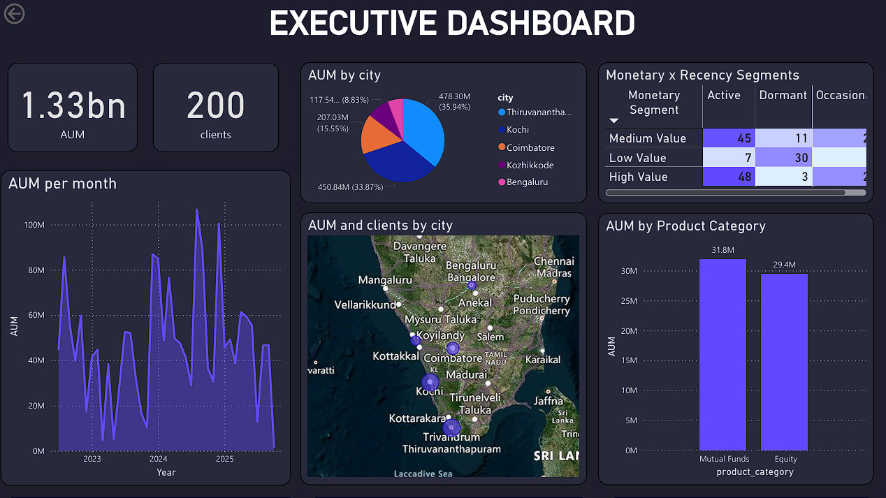
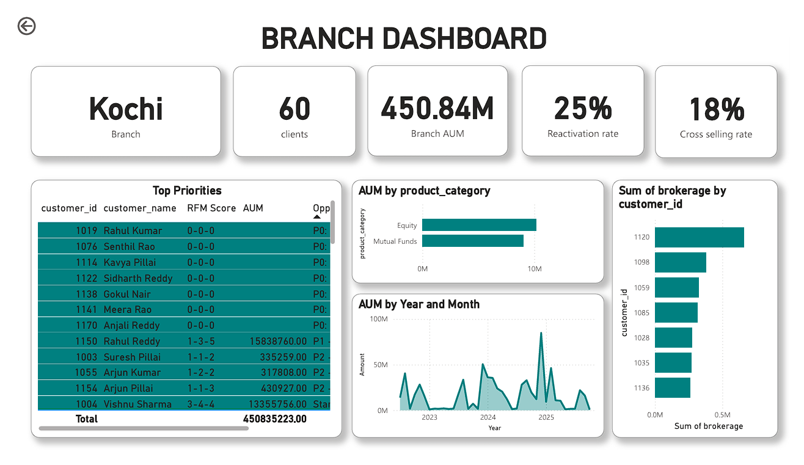

# 📈 Power BI Stock Broker Customer Visualization & Analytics

This repository features a comprehensive **Stock Broker Customer Visualization** system. The core of this project is a robust financial data engine I developed to simulate a real-world brokerage environment, tracking assets, transactions, and customer health through advanced BI. 

---

## 🏗️ Project Architecture
The project follows a structured data pipeline, ensuring that every visual insight is backed by logical financial data engineering.

* [cite_start]**Data Generation (Python)**: Custom scripts created to maintain relational integrity across customers, trades, and holdings. [cite: 1]
* [cite_start]**Relational Storage**: Structured data stored in optimized CSV files for high-performance BI modeling. [cite: 1]
* [cite_start]**BI Layer (Power BI)**: An interactive multi-page dashboard designed for Executive and Branch-level decision-making. [cite: 75]

---

## 🛠️ Innovative Data Engineering
Unlike a standard static dataset, this project includes a dynamic engine that reflects the complexities of the financial sector:

* [cite_start]**Relational Synchronization**: Every `portfolio_value` in the holdings table is logically consistent with the historical Buy/Sell transactions for that customer. [cite: 6]
* [cite_start]**Automated Brokerage Logic**: Simulated revenue model by calculating a 0.5% brokerage fee for Equity transactions, allowing for profitability analysis. [cite: 1]
* [cite_start]**RFM Scoring Engine**: An innovative segmentation model that scores clients on Recency, Frequency, and Monetary value to drive targeted marketing. [cite: 151]
* [cite_start]**Spatial Wealth Analysis**: AUM mapping across major South Indian hubs including Thiruvananthapuram, Kochi, Coimbatore, and Bengaluru. [cite: 21, 23]

---

## 🖼️ Dashboard Visuals

<table style="width:100%">
  <tr>
    <th>Executive Overview</th>
    <th>AUM Growth Trends</th>
  </tr>
  <tr>
    <td></td>
    <td></td>
  </tr>
</table>

### 🎯 High-Priority Customer Insights

  
   
  <i>Figure 1: Automated RFM-based Customer Priority Matrix</i>

---

## 📊 Business Intelligence Dashboard
The Power BI suite provides a 360-degree view of the brokerage’s health:

### 1. Executive Portfolio Overview
* [cite_start]**Total AUM**: Currently managing **1.33 Billion** in assets. [cite: 9]
* [cite_start]**Regional Dominance**: Thiruvananthapuram leads with **35.94%** of total AUM, followed by Kochi at **33.87%**. [cite: 19, 29]
* [cite_start]**Product Performance**: Detailed tracking across Mutual Funds ($31.8M$) and Equity ($29.4M$). [cite: 33, 37]

### 2. Customer Health & Priority Matrix
[cite_start]The dashboard features a **"Top Priorities"** matrix to help branch managers focus on high-impact clients: [cite: 86]

| customer_id | customer_name | RFM Score | Status |
| :--- | :--- | :--- | :--- |
| **1004** | **Vishnu Sharma** | **3-4-4** | [cite_start]**Star Customer** | [cite: 131, 132]
| **1150** | **Rahul Reddy** | **1-3-5** | [cite_start]**P1 Priority** | [cite: 117, 118]
| **1003** | **Suresh Pillai** | **1-1-2** | [cite_start]**Reactivation Target** | [cite: 120, 121]

---

## 📁 Repository Structure
* [cite_start]**`Customer.csv`**: Investor demographics and geographic data. [cite: 2]
* [cite_start]**`Transactions.csv`**: Historical trade logs with calculated brokerage. [cite: 1]
* [cite_start]**`Holdings.csv`**: Real-time portfolio snapshots across asset classes. [cite: 6]
* [cite_start]**`Products.csv`**: Product category master list (Equity, MF, PMS). [cite: 5]
* **`powerbi.pdf`**: The full multi-page visual report export. 
* **`powerbi.pbix`**: Visualization in Power BI format.

---

## 🚀 Future Roadmap
* [ ] Integrate Predictive Churn Analysis based on transaction frequency.
* [ ] Add Portfolio Variance and Sharpe Ratio calculations for risk management.
* [ ] Implement a live API connection for real-time stock price updates.
